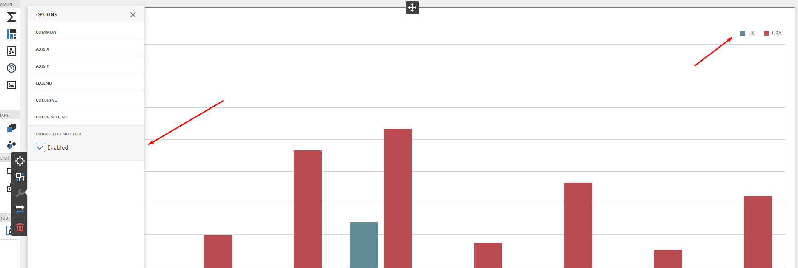

<!-- default badges list -->

<!-- default badges end -->
# BI Dashboard for MVC - How to Hide Series by Clicking on a Chart Legend (Custom Property)

This example illustrates how to hide series in a chart item by clicking on a legend icon. It is possible to enable or disable this functionality using a custom property:

**Limitation:**
Please note that this implementation works only when the chart coloring settings are set to Auto. Otherwise, you will have to redesign the extension.

## Documentation

- [Create Custom Properties](https://docs.devexpress.com/Dashboard/401702/web-dashboard/ui-elements-and-customization/create-custom-properties)

## Files to Review

* [Index.cshtml](./CS/MvcDashboard/Views/Home/Index.cshtml)
* [CustomPropertyChartSeriesVisibility.js](./CS/MvcDashboard/Content/CustomPropertyChartSeriesVisibility.js)

## More Examples

- [Dashboard for Web Forms - Custom Properties](https://github.com/DevExpress-Examples/asp-net-web-forms-dashboard-custom-properties-sample)
- [Dashboard for Web Forms - How to implement dependent custom properties in a custom item](https://github.com/DevExpress-Examples/CustomItemDependentProperties)
<!-- feedback -->
## Does this example address your development requirements/objectives?

 

(you will be redirected to DevExpress.com to submit your response)
<!-- feedback end -->
